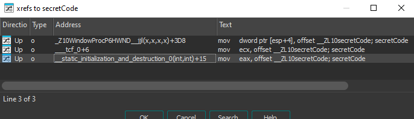

# crackmes.one - CrYP70NYM'S CRACKME FIXED

## Challenge Overview
**Title:** CrYP70NYM'S CRACKME FIXED  
**Author:** CrYP70NY  
**Difficulty:** 2.0  
**Quality:** 4.3  
**Language:** C/C++  
**Platform:** Windows  
**Arch:** x86-64  
**Files Provided:** cry-crackme.exe  

## Description
This is a very easy crackme for people who just started reverse engineering!

This is a fixed version btw i didn't realise the code generation was broken on the first release!

## Analysis
I will be using FlareVM to run the challenge  

Using `Detect It Easy (DIE)` we can assume that the executable is not packed.  


Running the program we see that it is a GUI application that asks for a code.


When I try to enter a random code we see an error message.


Now I will use `IDA Free` and `x64dbg` to dive deeper.  

When we open `IDA`, we are taken to the `WinMain()` which is the standard entry point for GUI applications.  
I will search for the `GRRR` in strings to see where it is referenced.  
I find the string and go to its one reference.


On the right hand side we see the error and success messages the program shows.  
At the left side we see the **==** operator and its two parameters.  
Our input I will assume is **var_44** and the second operand is labeled as **secretCode**.  
I follow it in memory but it has nothing, so I search for references.  
It has three references but I am interested in the one called static_initialization



We see a pointer to it being pushed on the stack and then a call to **__Z19GenerateValidSerialv**.  
I go to that function and we encounter a key generator.  
The argument to the function is the pointer to **secretCode** so I renamed it.  
The generator uses the classic **srand(time(0))** to initialize the standard pseudo random number generator.  


Then we see a loop that iterates 16 times and performs some operations


I added some comments next to the operations in pseudo code style to use for my own key generator algorithm

We see that each iteration it generates a new random number, performs some operations and increments the final result with **A** and appends it to the secret code.  
So it each loop generates a capital character and appends it to the code.  

Now it is the time for writing the Python script for the key generator and test it until it works.  

I slowly match the assembly instructions to Python code to replicate the process.  
To test it, I used **x64dbg** to find the result of **time(0)** which is the seed used and checking the result of the first iteration with mine


After I managed to make it work, I test the value my keygen generates on the process being debugged


And it worked!

Now use it on any arbitrary execution of the program without a debugger, I made it use the time frame of -5 seconds to +5 seconds of the current time in order to fit the time difference between launching the program and the keygen.

### Python Script
```python
import time
import random
import ctypes

# C's rand() and srand() from the standard library
libc = ctypes.CDLL("msvcrt.dll")
libc.srand.argtypes = [ctypes.c_uint]
libc.rand.restype = ctypes.c_int

def generate_secret_code(key, secret_code, print_val=False):
    high=((key*0x4EC4EC4F)>>32)&0xFFFFFFFF
    low=(key*0x4EC4EC4F)&0xFFFFFFFF
    high>>=3
    low = key
    low>>=0x1F
    high-=low
    low=high
    low *= 0x1A
    key-=low
    low=key
    low+=0x41
    secret_code+=chr(low&0xFF)
    return secret_code

def c_rand(seed, count=1):
    libc.srand(seed)
    return [libc.rand() for _ in range(count)]

# Use the timeframe -5 seconds -> +5 seconds of current time
start_time = int(time.time()) - 5
end_time   = int(time.time()) + 5
calls_to_rand = 16

# Generate code for every timestamp
for t in range(start_time, end_time + 1):
    values=c_rand(t, calls_to_rand)
    secret_code=""
    i=0
    for key in values:
        secret_code=generate_secret_code(key, secret_code, i==0)
        i+=1
    print(f"{hex(t)} => {secret_code}")
```

**NOTE:** The Python Script is meant to run on the same Windows machine as the program being executed in order for them to use the same **rand()** implementation

### Correct Execution Example
In one terminal run the program
```
>cry-crackme.exe
```
Then in another terminal quickly run
```
> python .\keygen.py
0x6899ff16 => YQUJOYWCCYVQZNPW
0x6899ff17 => BSOPHZOUVMDIMPDS
0x6899ff18 => FDIUAAGFXILARZJG
0x6899ff19 => INKHKAZQRWTSWCQU
0x6899ff1a => LQEMDBRASKCKJMEQ
0x6899ff1b => OAHSVUKLMYKCOOKE
0x6899ff1c => SKBXOUCWNLSUTZQA
0x6899ff1d => VNDKYVVHHHAMGBEO
0x6899ff1e => YXXQRWNRJVIEKLKK
0x6899ff1f => BIZVKXGCCJQWPNRY
0x6899ff20 => FKTAUXYNEXYOCYXU
```

And try each code until you get the success message
## Tools Used
- `Detect It Easy (DIE)`
- `IDA Free`
- `x64dbg`