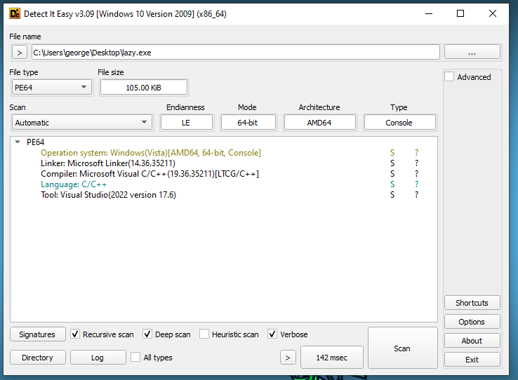
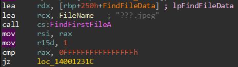
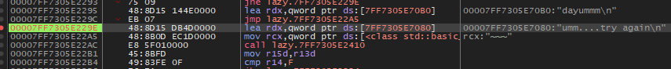
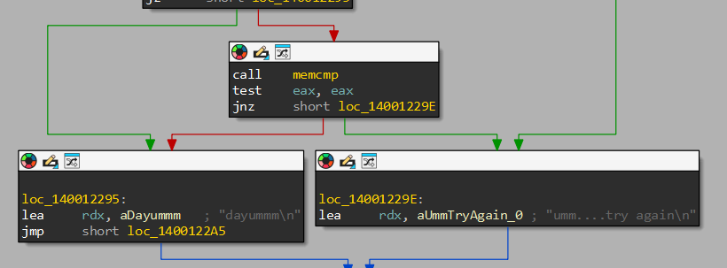
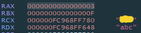

# crackmes.one - pixy

## Challenge Overview
**Title:** pixy  
**Author:** Boozy  
**Difficulty:** 2.0  
**Quality:** 4.0  
**Language:** C/C++  
**Platform:** Windows  
**Arch:** x86-64  
**Files Provided:** lazy.exe  

## Description
:)

## Analysis
I will be using FlareVM for the challenge which is a special RE virtual machine.  

The zip contains a `lazy.exe` file.  
Using `Detect It Easy (DIE)` we can assume that the executable is not packed.  


Now I will use `strings` to see static strings in the executable and get an idea
```
>strings lazy.exe
...
bad Image Descriptor
missing color table
...
???.jpeg
umm....try again
umm....try again
dayummm
```

We see that it has some image processing.  
We also `umm....try again` and `dayummm` which seem like an error message and the success message we are after.

Now I will use `IDA Free` and `x64dbg` to dive deeper.  



Towards the start of `main()` we can see a call to `FindFirstFileA()`.  
This searches for for the passed full file name and returns some information about it if it finds it.  
The file it searches for is `???.JPEG`.  
`?` is a wildcard character that means "Any single character".  
So it searches for any JPEG file with a three character long name in the same directory as the executable.  
So I take a screenshot and name it `abc.jpeg`.

Now I run the program
```
>lazy.exe
umm....try again
```

But nothing.

I will launch `x64dbg` and set a breakpoint at each location the `umm....try again` string is referenced and see which condition causes the fail.  
To do so I do the following:  
- Set a breakpoint at the start of `main()`, to do so find **.text** of **lazy.exe** in **Memory Map** and select **Follow in Dump**
- Click **Continue** until execution reaches `main()`
- Go to **Memory Map**, click **.rdata** of **lazy.exe** and select **Find Pattern**
- In the **String** write `umm....` and hit **Ok**
- For each reference, right click the first reference and hit **Toggle Breakpoint**

Now I hit **Continue** and see where it breaks



This maps to this in `IDA`


Now I set a breakpoint at the `memcmp()` call above that causes this and rerun.

`memcmp()` compares the pointers in the `rdx` and `rcx` registers which can easily se their values




And we see the strings `abc` and `<PASSWORD>` which are being compared.  

So we need to remain our image to `<PASSWORD>` and we will see `dayummm`

### Correct Execution Example
```
>lazy.exe
dayummm
```

## Tools Used
- `Detect It Easy (DIE)`
- `strings`
- `IDA Free`
- `x64dbg`