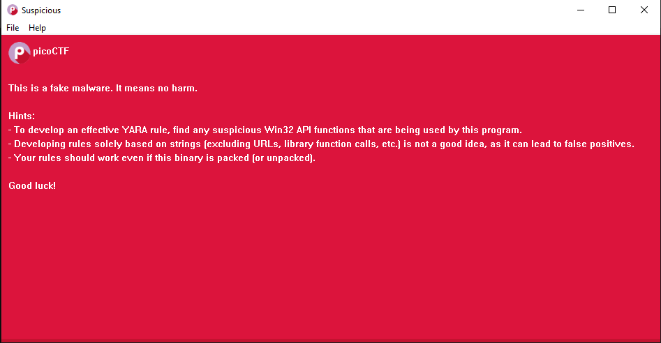
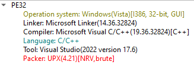

# PicoCTF - YaraRules0x100

## Challenge Overview
**Title:** YaraRules0x100  
**Category:** General Skills  
**Difficulty:** Medium  
**Files Provided:** suspicious.zip  

## Description
Dear Threat Intelligence Analyst, Quick heads up - we stumbled upon a shady executable file on one of our employee's Windows PCs. Good news: the employee didn't take the bait and flagged it to our InfoSec crew. Seems like this file sneaked past our Intrusion Detection Systems, indicating a fresh threat with no matching signatures in our database. Can you dive into this file and whip up some YARA rules? We need to make sure we catch this thing if it pops up again. Thanks a bunch! The suspicious file can be downloaded here. Unzip the archive with the password picoctf

Additional details will be available after launching your challenge instance.

## Analysis
We extract the ZIP file using the password `picoCTF`.  
We find a `suspicious.exe` file.  

We **run** it as **administrator** and see the following  


Using `Detect It Easy (DIE)` we verify that executable is packed using `UPX`   


We will unpack using 
```
upx -d suspicious.exe -o suspicious_unpacked.exe
```

We need to write **YARA** rules that will **work** for **both** the **packed** and **unpacked** versions

#### What is YARA
`YARA` (Yet another Recursive Acronym) is used to **identify malware** based on **patterns** that can be found in the file.  
**Patterns** can be **strings** found inside it, **library functions** used, **URLs** and more.  

To find these rules, we can **look** at the **strings** statically found inside **both executables** and find **common** ones that are also **unique** to the executable.  
To do so, we can use the `strings` tool. 

The **packed** executable has **fewer** strings and some that much seem **incomplete**.  
For **example**, the library function `IsDebuggerPresent` is cut to `IsDebuggerP`.  
This isn't a problem since we can simply **use** the **incomplete** string.

#### Some Common Strings 
- elcome to the YaraRules0x100 cha
- IsDebuggerP
- WaitFor
- InitializeSListHea
- LookupPriv
- ...

I will **start** by **slowly** adding **strings** to see what happens.  
### Initial YARA File
```
import "pe"

rule Detect_Suspicious_PE_String
{
    strings:
    $s1 = "elcome to the YaraRules0x100 cha" wide ascii
    condition:
        pe.is_pe and $s1

}
```
Here we **check** that the **file** is a **Portable Executable (PE)** and that it **contains** the `elcome to the YaraRules0x100 cha`.

We **run** the **command given** to us when **launching** the instance
```
:::::

Status: Failed
False Negatives Check: Testcase failed. Your rule generated a false negative.
False Positives Check: Testcase failed. Your rule generated a false positive.
Stats: 62 testcase(s) passed. 1 failed. 1 testcase(s) unchecked. 64 total testcases.
Pass all the testcases to get the flag.

:::::
```

We see that it **passes** 62 out of 64 tests and **fails** with a **false positive** and **false negative** result.  
Now I try to **add** a **second string** by trying each one until I get a better result.  
### Next YARA File
```
import "pe"

rule Detect_Suspicious_PE_String
{
    strings:
    //$s1 = "elcome to the YaraRules0x100 cha" wide ascii
    $s1 = "elcome" wide ascii
    $s2 = "WaitFor" wide ascii
    condition:
        pe.is_pe and $s1 and $s2

}
```
```
:::::

Status: Failed
False Negatives Check: Testcase failed. Your rule generated a false negative.
False Positives Check: Testcases passed!
Stats: 63 testcase(s) passed. 1 failed. 0 testcase(s) unchecked. 64 total testcases.
Pass all the testcases to get the flag.

:::::
```
Great, now **only** one **false negative** test remains.  
**False** negative means that it **missed** one **executable**.  
So **adding** more **strings** will **not help**.

I **experiment** with **replacing strings** and **trying** different **combinations** but everything was **unsuccessful**.  

Finally, it was the `YaraRules0x100` the problem.  
It seems like the final **check omitted** this string from the **executable** and therefore was **not flagged**.  
So I **removed** it and **kept** only the `elcome` part of the string.

### Final YARA File
```
import "pe"

rule Detect_Suspicious_PE_String
{
    strings:
    $s1 = "elcome" wide ascii
    $s2 = "WaitFor" wide ascii
    condition:
        pe.is_pe and $s1 and $s2

}
```

## Solution
- Unpack `suspicious.exe`
- Find common strings between the packed and unpacked versions
- Create a YARA file specifying rules based on these strings
- Avoid including `YaraRules0x100` in any string  
  **OR**
- Use the provided YARA file (yara.txt)

### Execution Example:
```
$ socat -t60 - TCP:standard-pizzas.picoctf.net:56371 < yara.txt
:::::

Status: Passed
Congrats! Here is your flag: picoCTF{____REDACTED____}

:::::
```