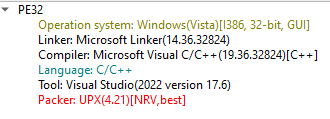

# PicoCTF - WinAntiDbg0x300

## Challenge Overview
**Title:** WinAntiDbg0x300  
**Category:** Reverse Engineering  
**Difficulty:** Medium  
**Files Provided:** WinAntiDbg0x300.zip

## Description
If you have solved WinAntiDbg0x100, you'll discover something new in this one. Debug the executable and find the flag! This challenge executable is a Windows console application, and you can start by running it using Command Prompt on Windows. This executable requires admin privileges. You might want to start Command Prompt or your debugger using the 'Run as administrator' option. Challenge can be downloaded here. Unzip the archive with the password picoctf 

## Initial Analysis
Upon extracting the zip with `picoctf` password we see an executable name `WinAntiDbg0x300.exe`.

Using `Detect It Easy (DIE)` we see it is an **packed** 32-bit executable.  
The packer used is **UPX**.  


So we use `upx` CLI tool to unpack it `upx -d WinAtniDbg0x300`.

We also see form `DIE` that it is a **GUI** program

When running th program we see a window as expected.


Using `strings` we see the following which is similar to the previous challenges:

### `strings`
```
[FATAL ERROR]  Unable to create the child process. Challenge aborted.
Something went wrong. Challenge aborted.
The debugger was detected but our process wasn't able to fight it. Challenge aborted.
Our process detected the debugger and was able to fight it. Don't be surprised if the debugger crashed.
### Something went wrong...
You got the flag!
### Good job! Here's your flag:
### ~~~
### (Note: The flag could become corrupted if the process state is tampered with in any way.)
...
IsDebuggerPresent
...
```

## Detailed Analysis
Now I will use `IDA Free` to view the disassembly and `x32dbg` to debug it.

Inspecting the code in graph view of **WinMain** in `IDA`, we see a block printing the error message and the parent block has a jump.  
That's the first place we will have to change the control follow


We set a breakpoint at the jump in `x32dbg` and change the **Zero Flag (ZF)** to **1**.

On the branch now taken, we see some function calls that perform some checks, like admin privileges, or show the window which we don't care about.  
The fourth call, however, is **similar** to the second challenge, WinAntiDbg0x200, where a **mutex** is used to diverge control flow of a **child** process to launch a **debugger** on the parent process.  

The following block, creates a thread starting from a routine


One is the result of `IsDebuggerPresent`, the other is the block before it which checks the return value of the routine `sub_4011D0`


Starting from `sub_4011D0`, we see it creates a new process.


**Note:** Any names given to user routines (not library functions) where given by me.

Again, similarly to the previous challenge, we see one branch starting a **new** process, which is the same executable, which launches a **debugger** on the parent process using the **mutex** diversion technique.  


The **branch** depends on the value of `eax` which is always set to 1, meaning a new process is **always** created.

To **bypass** this, we set a breakpoint after the `mov eax, 1` and set `eax` value to 0.

Now we will get our **flag**.

## Solution
Using a debugger like `x32dbg`
-  Set a **breakpoint** at the **jump** in WinMain which goes to the block **printing** "Oops! Debugger Detected" and change the value of **Zero Flag** to **1**.
- Set a breakpoint after `mov eax, 1` inside `debugger-checker` at the start of the **infinite** loop and set `eax` to 0

## Tools Used
- `DIE`
- `strings`
- `upx`
- `IDA Free`
- `x32dbg`