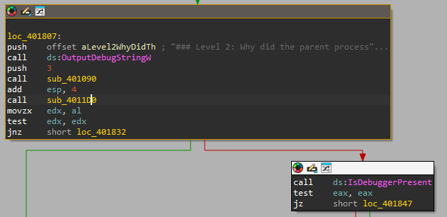
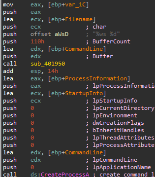
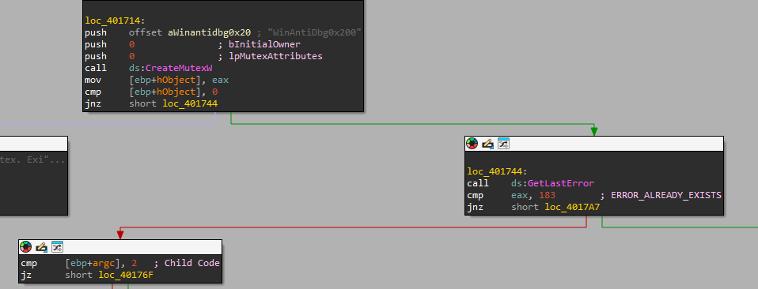
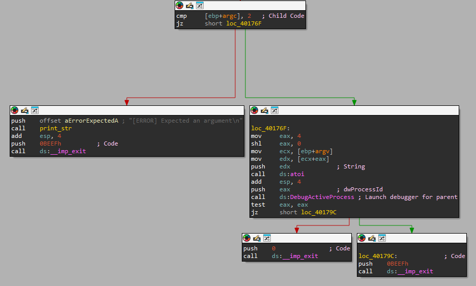
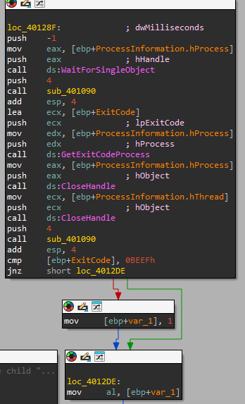

# PicoCTF - WinAntiDbg0x200

## Challenge Overview
**Title:** WinAntiDbg0x200  
**Category:** Reverse Engineering  
**Difficulty:** Medium  
**Files Provided:** WinAntiDbg0x200.zip

## Description
If you have solved WinAntiDbg0x100, you'll discover something new in this one. Debug the executable and find the flag! This challenge executable is a Windows console application, and you can start by running it using Command Prompt on Windows. This executable requires admin privileges. You might want to start Command Prompt or your debugger using the 'Run as administrator' option. Challenge can be downloaded here. Unzip the archive with the password picoctf 

## Initial Analysis
Upon extracting the zip with `picoctf` password we see an executable name `WinAntiDbg0x200.exe`.

Using `Detect It Easy (DIE)` we see it is an **unpacked 32-bit** executable.

When running it from a command prompt we see this:
```
        _            _____ _______ ______
       (_)          / ____|__   __|  ____|
  _ __  _  ___ ___ | |       | |  | |__
 | '_ \| |/ __/ _ \| |       | |  |  __|
 | |_) | | (_| (_) | |____   | |  | |
 | .__/|_|\___\___/ \_____|  |_|  |_|
 | |
 |_|
  Welcome to the Anti-Debug challenge!
### To start the challenge, you'll need to first launch this program using a debugger!
```

So we need to run it with a **debugger**.

Similarly to the previous challenge, `strings` shows the following:

### `strings`
```
### To start the challenge, you'll need to first launch this program using a debugger!
### Error reading the 'config.bin' file... Challenge aborted.
### Level 1: Why did the clever programmer become a gardener? Because they discovered their talent for growing a 'patch' of roses!
### Oops! The debugger was detected. Try to bypass this check to get the flag!
### Something went wrong...
### Good job! Here's your flag:
...
IsDebuggerPresent
...
```

We see some of the programs **output** strings and the last one (### Good job! Here's your flag) is **probably** where the flag will be printed.

## Detailed Analysis
Now I will use `IDA Free` to view the disassembly and `x32dbg` to debug it.

Inspecting the code in graph view of main in `IDA`, I find the debugger detected error output and see two locations that jump to it.  
One is the result of `IsDebuggerPresent`, the other is the block before it which checks the return value of the routine `sub_4011D0`


Starting from `sub_4011D0`, we see it creates a new process.



The process started is the one contained in the `CommandLine` variable which takes its value from the `sub_401090` routine.

Using `x32dbg`, I set a breakpoint after `sub_401090` and check the value at `CommandLine`.  
I see **/file/path/WinAntiDbg0x200 5628**.

It **spawns** a new process with the same binary and an a number. 

Going back to main in the disassembly, we see this further above :


The process creates or opens, if it exists, a **mutex** and locks it, then checks if there is an error with value **183**.  
183 is equivalent to **ERROR_ALREADY_EXISTS**, which happens when the mutex already exists.

So, the parent thread **creates** the mutex, **spawns** a child and when the child tries to create the mutex it sees that it is already **locked** which **diverges** its execution from the parent down the false (left) path.

### Child Execution Path


The child checks if it has an argument (By convention the first argument always exists and is the program name).  
If it does, then it converts it to an integer using `atoi` and starts **debugging** a process with the given **id**.

This means that the **argument** the child starts with by the parent is the parent's **process id** and the child essentially starts **debugging** its parent.  
If the debugger is launched successfully, then the child exits with the value **0xBEEF** (0xBEEF and 0xDEADBEEF are common values used as a markers since it easy to find).

Going back to routine `sub_401090`, which from now on I will call `launch_debugger`, we see that the parents waits for the child, `WaitForSingleObject` and gets its exit code, `GetExitCodeProcess` compares it with **0xBEEF** and returns **1** if it matches else **0**.



And finally, main checks if `launch_debugger` returns **1**, debugger was launched successfully so it crashes, or **0**, debugger not launched successfully.

Moving on to `IsDebuggerPresent`, this is the exact same as the first challenge.  
Simply returns **1** if a debugger is detected else **0**.

To bypass both of these, we have to change the return value of both `launch_debugger` and `IsDebuggerPresent`.

## Solution
Using a debugger, set a breakpoint after `launch_debugger` and `IsDebuggerPresent` and change the value of eax from **1** to **0** 

## Tools Used
- `strings`
- `IDA Free`
- `x32dbg`